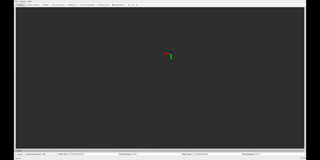
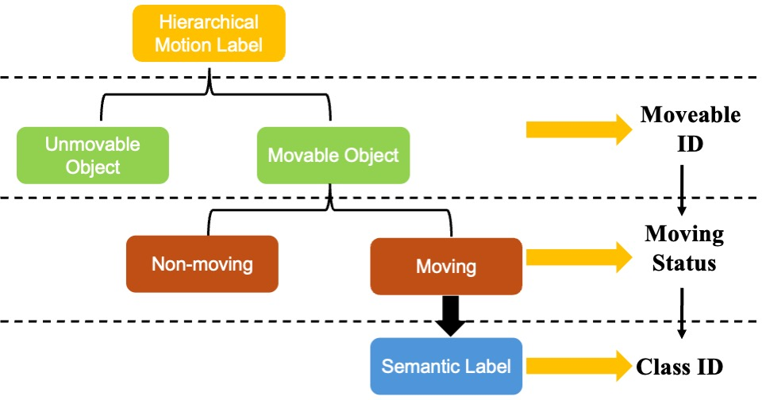
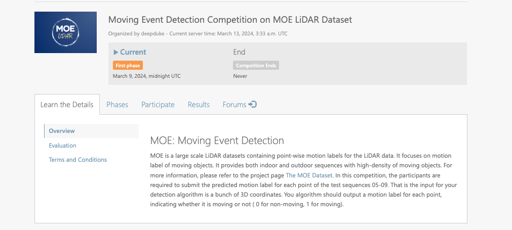

# MOE-Dataset: A Dense LiDAR Moving Event Dataset

<!-- <div align="center">

 

</div> -->

<div align="center">
    
</div>

<div align="center">

### [Project Page](https://sites.google.com/view/moe-dataset) | [Paper] | [Competition](https://codalab.lisn.upsaclay.fr/competitions/18028) | [Dataset](https://github.com/DeepDuke/MOE-Dataset/releases/tag/publish_dataset)

</div>

## Dataset

### Sequences Format

We collect multiple sequences from simulators/real urban campus containing both high-density moving objects for indoor/outdoor scenes. An overview for these sequences are as follows. (Actually there are much more moving/non-moving points than you can in these animations since we lower the opacity of pointcloud to make these visualization more human-friendly visible.)


<div align="center">

| 00 | 01 | 02 | 03 | 04 |
| :-------------: | :-------------: | :-------------: | :-------------: | :-------------: |
|  |    |    |    |    |

</div>

<div align="center">

| 05 | 06 | 07 | 08 | 09 |
| :-------------: | :-------------: | :-------------: | :-------------: | :-------------: |
|    |    |    |    |    |

</div>

The folder of whole dataset is like this:

```bash
MOE-Dataset
├── 00
│   ├── gt_poses.txt
│   ├── label/
│   └── pcd/
├── 01
│   ├── gt_poses.txt
│   ├── label/
│   └── pcd/
├── 02
│   ├── gt_poses.txt
│   ├── label/
│   └── pcd/
├── 03
│   ├── gt_poses.txt
│   ├── label/
│   └── pcd/
... ...
├── 08
│   ├── gt_poses.txt
│   ├── pcd/
|
├── 09
│   ├── gt_poses.txt
│   ├── pcd/
|___ ___

```
#### Pointcloud

Each scan frame is provided as `xxxxxx.pcd` with `x,y,z` information. We choose to privode the raw `*.pcd` file for eaiser visualization and loading, although binary format adopted by [SemanticKITTI](https://github.com/PRBonn/semantic-kitti-api) may be more storage efficient. It's very easy to read the pointcloud files using library like [Open3D](https://github.com/isl-org/Open3D).

#### Label
For the label file `xxxxxx.txt`, each row is the hierarchical motion label for each point in the cooresponding pcd file, which is defined as:

<div align="center">



</div>

Thus, each row in the label file `xxxxxx.txt` is

 ```python
 Moveable_ID Moving_Status Class_ID
 ```
 
We denote the moveable point as `1` otherwise `0`, the moving status as `1` otherwise `0`. BTW, we only provide the semantic class ID for moving points otherise `-1` for non-moving points. 

#### Ground truth Pose

For each sequence, the ground truth poses for all scans are store in `gt_poses.txt`. Each row in `gt_poses.txt` represents the pose for the cooresponding ordered scan. For example, first row represents the pose for `000000.pcd` in that sequence. We adopt the KIIT format to reprensent the pose, that is the first 3 rows of elements in the `4x4` transformation matrix.

```python
# Each row in gt_poses.txt
R11 R12 R13 x R21 R22 R23 y R31 R32 R33 z

# The cooresponding 4x4 transformation matrix
T = 
[
    R11 R12 R13 x
    R21 R22 R23 y
    R31 R32 R33 z
    0   0   0   1
]
```

### Download

We put the zipped sequence file in the release of this repository. Please download and unzip them. Note: Some pcd file of sequences may be splitted into several zipped file due to the siingle file limitation of Github is 2GB. Please merge  the unzipped files into same sequence folder.


## Benchmark

We evaluate some SOTA algorithms on sequences `00,01,02` to set up a reference benchmark for their performance. We test 3 offline non-learning methods - [Removert](https://github.com/gisbi-kim/removert), [ERASOR](https://github.com/LimHyungTae/ERASOR), and [Octomap](https://github.com/Kin-Zhang/octomap/tree/feat/benchmark); 3 online non-learning methods - [Dynablox](https://github.com/ethz-asl/dynablox), [DOD](https://github.com/UTS-RI/dynamic_object_detection/), [M-detector](https://github.com/hku-mars/M-detector); two representives for differnt branches of learning based methods - [MotionBEV](https://github.com/xiekkki/motionbev) and [InsMOS](https://github.com/nubot-nudt/InsMOS). For non-learning based methods, we tried to tune those params on each sequence. For learn-based methods, we test them using model trained on the larger scale dataset SemanticKITTI to validate their generalization ability. Actually current learning-based methods are verry easy to overfit on single structure dataset (like urban high ways), and not so robust on different structured high-density scenes in this dataset.

<div align="center">

| Erasor on Seq 00 | MotionBEV on Seq 01 | Insmos on Seq 02 |
| ----- | ----- | ----- |
|   |   |   |

</div>


We compute the mean IoU metric over sequences `{00, 01, 02}` for these algorithms. We refer the moving point as positve while non-moving point as negative.

```
IoU = TP / (TP + FP + FN)
```

<div align="center">

| Seq | [Removert](https://github.com/gisbi-kim/removert) | [ERASOR](https://github.com/LimHyungTae/ERASOR) | [Octomap](https://github.com/Kin-Zhang/octomap/tree/feat/benchmark) | [Dynablox](https://github.com/ethz-asl/dynablox) | [DOD](https://github.com/UTS-RI/dynamic_object_detection/) | [M-detector](https://github.com/hku-mars/M-detector) | [MotionBEV](https://github.com/xiekkki/motionbev) | [InsMOS](https://github.com/nubot-nudt/InsMOS) |
| :-----: | :-----: | :-----: | :-----: | :-----: | :-----: | :-----: | :-----: | :-----: |
| 00 | 0.297 | 0.378 | 0.328 | 0.320 | **0.786** | 0.305 | 0.002 | 0.495 |
| 01 | 0.028 | 0.028 | 0.031 | 0.195 | 0.142 | 0.174 | 0.055 | **0.282** |
| 02 | 0.421 | 0.627 | 0.652 | 0.492 | 0.595 | 0.044 | 0.069 | 0.379 |
| mIoU | 0.249 | 0.344 | 0.337 | 0.336 | **0.508** | 0.174 | 0.042 | 0.385 |

</div>

## Competition and Leaderboard

<div align="center">



</div>

To facilliate the related community, we utilize part sequences `{05,06,07,08,09}` to host a Moving Event Detection with LiDAR on [CodaLab](https://codalab.lisn.upsaclay.fr/). So our dataset will only provide motion label for sequences `{00, 01, 02, 03, 04}`, for sequences `{05, 06, 07, 08, 09}` we will only publish the pointcloud files and ground truth poses.

The link for our competition is at https://codalab.lisn.upsaclay.fr/competitions/18028. If you are interested in it, please feel free to take part in it!

## Issues

If you have any question about this dataset, please feel free to open an issue for discussion. TKS!

## Acknowledgement

We want thank the following open source code and dataset.

- [Removert](https://github.com/gisbi-kim/removert)
- [ERASOR](https://github.com/LimHyungTae/ERASOR)
- [An improved version of Octomap](https://github.com/Kin-Zhang/octomap/tree/feat/benchmark)
- [Dynablox](https://github.com/ethz-asl/dynablox)
- [DOD (dynamic_object_detection)](https://github.com/UTS-RI/dynamic_object_detection/)
- [DynamicMap_Benchmark](https://github.com/KTH-RPL/DynamicMap_Benchmark)
- [M-detector](https://github.com/hku-mars/M-detector)
- [MotionBEV](https://github.com/xiekkki/motionbev)
- [InsMOS](https://github.com/nubot-nudt/InsMOS)
- [SemanticKITI Dataset](https://github.com/PRBonn/semantic-kitti-api)

## Citation

Citation format is comming soon! 

If you find this dataset useful to you, please feel free to give us a star! TKS!

## Star History

[](https://star-history.com/#DeepDuke/MOE-Dataset&Date)
